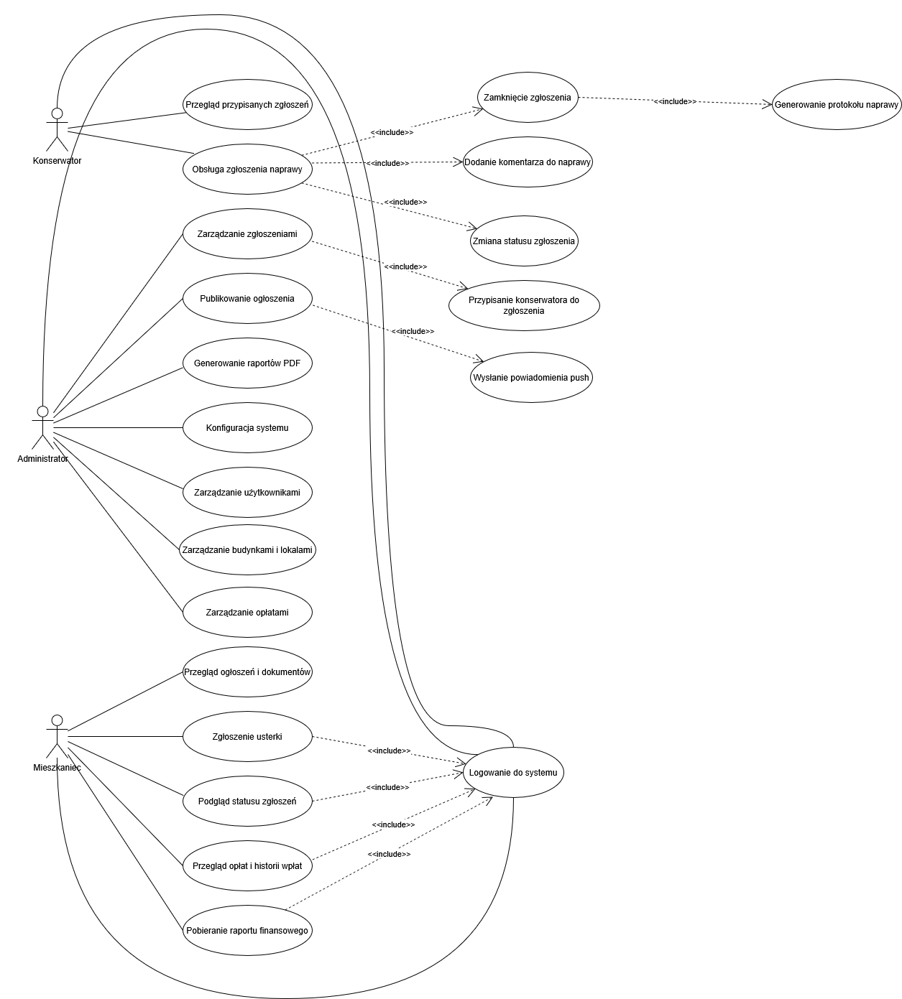
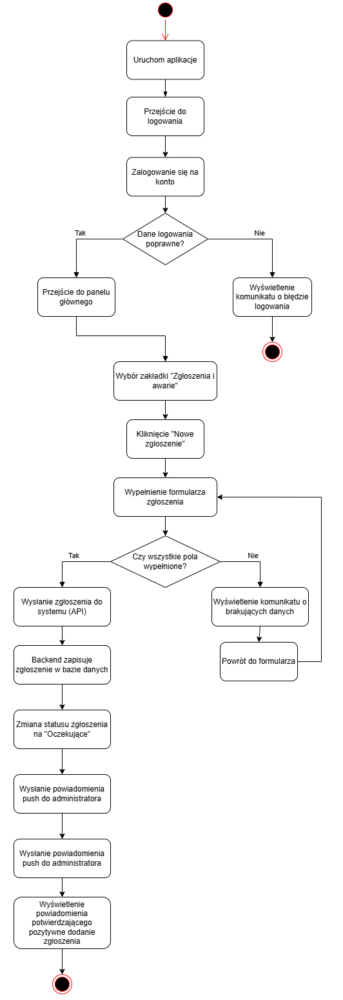
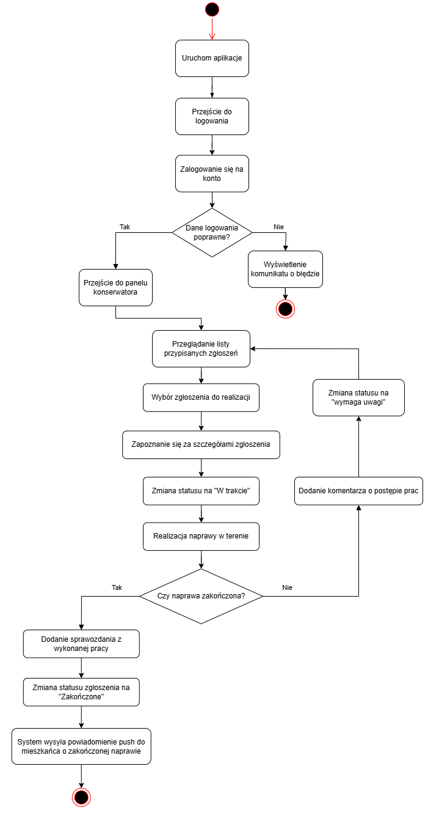
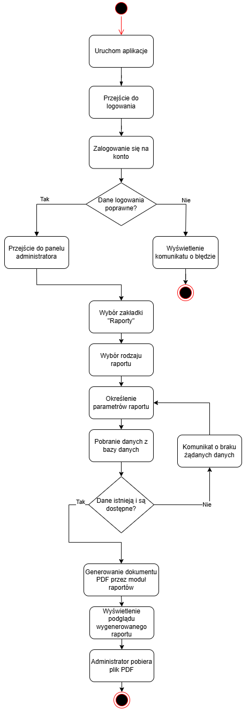
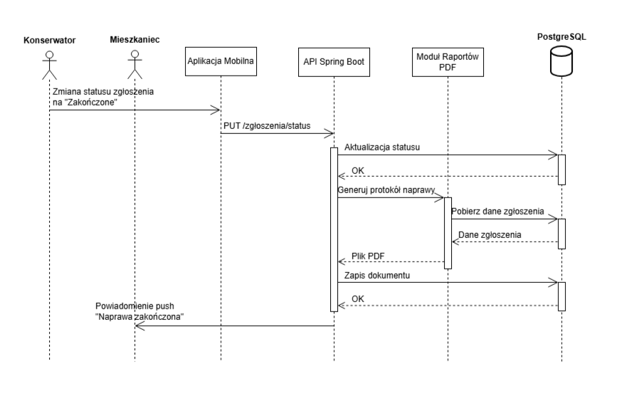
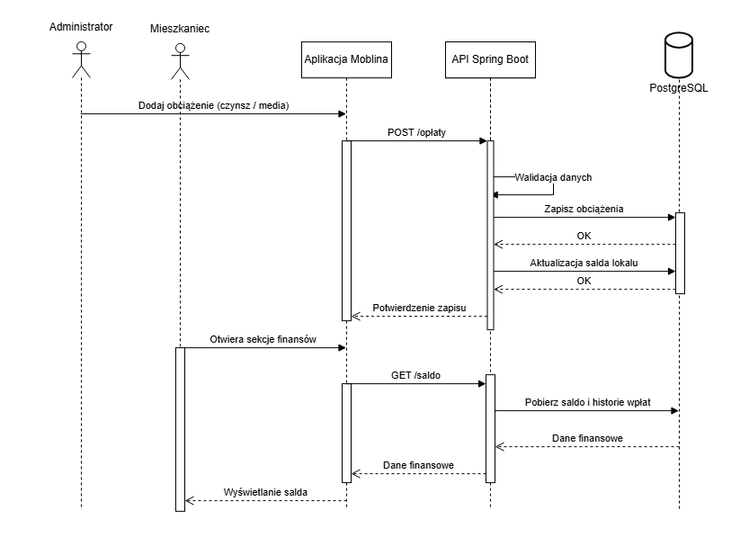
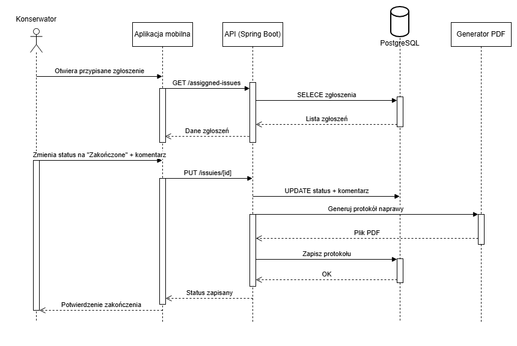

# Diagramy UML

W tym pliku znajdują się diagramy UML wraz z opisem, pojedyncze pliki można odnaleźć w folderze [uml](../uml/) w repozytorium projektu.

## Diagram przypadków użycia

## Diagramy aktywności
1. Zgłaszanie usterki przez mieszkańca

2. Obsługa zgłoszenia przez konserwatora

3. Generowanie raportu PDF przez administratora

## Diagramy sekwencji
1. Zamknięcie zgłoszenia i generowanie PDF

2. Naliczenie opłat czynszowych

3. Naprawa usterki

